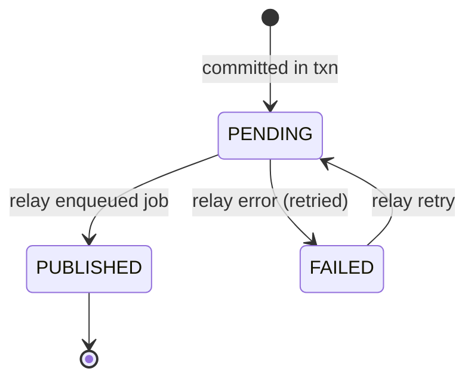

# NotiFly Architecture

This document describes the architecture of NotiFly at a level of detail that
is useful to contributors and operators. It is the canonical design reference.

## 1. Design goals

1. **Guaranteed delivery.** No notification is ever lost. The database is the
   system of record; Redis and the worker are replaceable transport.
2. **Channel-agnostic.** Providers are interchangeable adapters. No
   provider-specific logic lives outside the provider package.
3. **Operationally complete.** Idempotency, correlation IDs, retries,
   scheduling, dead letters, metrics, and audit trails are first-class.
4. **Extensible.** Adding a provider or a new delivery channel requires minimal
   new code and no changes to the core.

## 2. Layering

Strict clean architecture. Dependencies point inward only:

```
┌───────────────────────────────────────────────────────────────┐
│ presentation  FastAPI routers, schemas, deps, worker jobs     │
├───────────────────────────────────────────────────────────────┤
│ application   use-case services (orchestration, no I/O)       │
├───────────────────────────────────────────────────────────────┤
│ domain        entities, value objects, enums, errors, ports   │
├───────────────────────────────────────────────────────────────┤
│ infrastructure SQLAlchemy, Redis, ARQ, providers, Prometheus  │
└───────────────────────────────────────────────────────────────┘
```

Rules:

- The **domain** layer imports nothing from any other layer.
- The **application** layer depends only on domain ports and value objects.
- The **infrastructure** layer implements domain ports.
- The **presentation** layer is the composition root: it builds services and
  wires concrete adapters, then exposes them over HTTP/queues.
- Business rules never appear in FastAPI routes.

### 2.1 Module map

```
src/notifly/
├── config.py                       # pydantic-settings, NOTIFLY_ prefix
├── logging.py                      # structured logs + correlation contextvar
├── main.py                         # FastAPI factory (composition root)
├── domain/
│   ├── enums.py                    # ChannelType, statuses, outbox states
│   ├── errors.py                   # NotiFlyError hierarchy
│   ├── models/                     # entities & value objects (pydantic)
│   │   ├── application.py          # Application, ApiKey
│   │   ├── channel.py              # ChannelConfig
│   │   ├── template.py             # Template, VariableDef, channel content
│   │   ├── notification.py         # Notification, Delivery, DeliveryAttempt
│   │   ├── audit.py                # AuditLogEntry
│   │   ├── outbox.py               # OutboxEvent
│   │   └── idempotency.py          # IdempotencyRecord
│   ├── ports/                      # abstract interfaces
│   │   ├── repositories.py         # UnitOfWork + repository protocols
│   │   ├── providers.py            # Provider, ProviderCapabilities, registry
│   │   ├── rate_limit.py           # RateLimiter protocol
│   │   ├── tasks.py                # TaskDispatcher protocol
│   │   └── clock.py                # Clock protocol
│   └── providers.py                # ProviderMessage/Result, capabilities
├── application/
│   ├── security.py                 # API key generation + PBKDF2 hashing
│   ├── services/
│   │   ├── applications.py         # apps + api keys use cases
│   │   ├── channels.py             # channel config use cases
│   │   ├── templates.py            # template use cases + rendering
│   │   ├── notifications.py        # Notification Engine
│   │   ├── dispatcher.py           # Dispatcher
│   │   ├── outbox.py               # Outbox publisher service
│   │   ├── audit.py                # audit writing
│   │   └── operations.py           # ops/query use cases
│   └── dto.py                      # cross-layer data transfer objects
├── infrastructure/
│   ├── db/                         # engine, ORM models, repositories, alembic
│   ├── providers/                  # built-in providers (SMTP, Slack, ...)
│   ├── redis/                      # RedisRateLimiter, ArqTaskDispatcher
│   └── observability/              # Prometheus metrics
└── presentation/
    ├── api/                        # routers, schemas, deps, middleware
    └── workers/                    # ARQ worker definition + jobs
```

## 3. The core flow

### 3.1 Sending a notification (transactional outbox)

```
 REST request
      │
      ▼
 ┌──────────────┐      Idempotency-Key lookup ──▶ return existing if duplicate
 │ API router   │
 └──────┬───────┘
        │  (no business logic)
        ▼
 ┌──────────────────────┐
 │ Notification Engine  │  validate variables, render templates, build
 │ (application layer)  │  per-channel payloads, compute delivery plan
 └──────┬───────────────┘
        │
        ▼
 ┌───────────────────────────────┐
 │ ONE database transaction      │
 │   • notifications            │
 │   • deliveries               │
 │   • delivery_attempts (none) │
 │   • outbox_events (PENDING)  │
 │   • audit_logs               │
 │   • idempotency_records      │
 └──────────────┬────────────────┘
        │  COMMIT  ──────────────  DB is now the source of truth
        ▼
 ┌──────────────────────┐
 │ Outbox Publisher     │  poll PENDING outbox rows (ARQ cron),
 │ (relay)              │  enqueue dispatch job → mark PUBLISHED
 └──────┬───────────────┘
        │
        ▼
 ┌──────────────────────┐
 │ Dispatcher           │  rate-limit → invoke provider → record
 │ (ARQ worker job)     │  attempt → transition state → schedule retry
 └──────────────────────┘
```

If Redis or the worker is down, the outbox rows simply stay `PENDING` and are
picked up when they return. **Nothing is lost.**

### 3.2 Dispatch split

Orchestration and transport are separated into two application services:

| Concern | Notification Engine | Dispatcher |
|---|---|---|
| Variable validation | ✅ | |
| Template rendering | ✅ | |
| Delivery plan computation | ✅ | |
| Persistence + state transitions | ✅ (create) | ✅ (send) |
| Idempotency | ✅ | |
| Outbox event emission | ✅ | |
| Rate limiting | | ✅ |
| Provider invocation | | ✅ |
| Attempt recording | | ✅ |
| Retry scheduling | | ✅ |
| Dead-lettering | | ✅ |

The engine produces a fully-rendered, ready-to-send payload persisted on the
`Notification`. The dispatcher never renders; it only transports. This keeps
the worker small, restart-safe, and independently scalable.

### 3.3 Scheduled notifications

- The engine persists the notification with `scheduled_at` in the future and
  **does not** emit an outbox event.
- A cron job (`poll_scheduled`) finds due notifications and emits an outbox
  event for each, in a transaction.
- The normal outbox path then takes over.

Scheduling is DB-backed, so it survives restarts of every component.

### 3.4 Retries

- Each channel config declares `max_attempts` and a base backoff.
- On a transient provider failure the dispatcher records a failed attempt and
  sets `next_attempt_at` on the delivery (exponential backoff, jittered).
- A cron job (`poll_retries`) re-emits an outbox event when a delivery becomes
  due again.
- After `max_attempts`, the delivery is permanently `FAILED` and the
  notification is dead-lettered (see Operations API).
- An operator can `POST /v1/operations/notifications/{id}/retry` to requeue.

## 4. Domain model

### 4.1 State machines

`NotificationStatus`: `PENDING → PROCESSING → SENT | PARTIAL | FAILED`, and
`CANCELLED` from `PENDING`.

`DeliveryStatus`: `PENDING → PROCESSING → SENT | FAILED`, with `next_attempt_at`
driving the retry loop.

`OutboxStatus`: `PENDING → PUBLISHED`, `PENDING → FAILED` (publisher error, will
be retried).

### 4.2 Key entities

- **Application** — a workspace/tenant. Owns templates, channels, notifications.
- **ApiKey** — scoped to an application. Only the hash (PBKDF2-SHA256) is
  stored; the plaintext is shown once at creation. Prefix identifies the key.
- **ChannelConfig** — per application, per `ChannelType`: provider settings,
  `enabled`, retry policy, rate limit.
- **Template** — keyed by `event` within an application. Declares variables and
  per-channel content (subject/body). Rendered with sandboxed Jinja2.
- **Notification** — one logical send: event, variables, optional `scheduled_at`,
  rendered per-channel payloads, status, correlation ID.
- **Delivery** — one channel of a notification. Status, attempts, `next_attempt_at`,
  last error, provider message ID.
- **DeliveryAttempt** — an immutable audit record of one provider invocation.
- **AuditLogEntry** — immutable event stream, written in the same transaction as
  the mutation it records.
- **OutboxEvent** — the outbox unit; carries `notification_id` + correlation ID.
- **IdempotencyRecord** — `(application_id, key)` unique; stores a request hash
  and the resulting notification ID.

## 5. Providers

Providers are adapters behind a single interface (see
[docs/providers.md](providers.md)). Every provider declares a
`ProviderCapabilities` object (e.g. `supports_html`, `supports_attachments`,
`supports_templates`, `supports_scheduling`) and a `channel_type`. Providers
are auto-discovered via the `notifly.providers` entry-point group, plus the
built-ins, and are registered in a `ProviderRegistry`.

The dispatcher interacts only with the `Provider` port and the capabilities
metadata. There is **no provider-specific logic** in the application layer.

## 6. Cross-cutting concerns

### 6.1 Idempotency

The `Idempotency-Key` header is honored on notification creation. On a
duplicate key with an identical request hash, the existing notification is
returned (HTTP 200 with the same ID). A key reused with a different payload
yields `409 Conflict`. Records are written in the same transaction as the
notification, so idempotency holds under retries and partial failures.

### 6.2 Correlation IDs

- Accepted from `X-Correlation-ID`; generated (UUID) when absent.
- Stored on the `Notification` and every `OutboxEvent`/`AuditLogEntry`.
- Threaded through provider HTTP requests as `X-Correlation-ID` and included in
  SMTP `Message-ID`/headers.
- Injected into every log record via a `contextvars.ContextVar` so one request
  can be traced end-to-end.

### 6.3 Rate limiting

A token-bucket `RateLimiter` keyed by `(application_id, channel_type)`.
The production adapter is backed by Redis (atomic Lua script); an in-memory
adapter is used for tests and single-node deployments.

### 6.4 Audit logging

Every mutating use case appends an `AuditLogEntry` in the same transaction:
actor (API key prefix), action, resource type/id, correlation ID, and a
non-sensitive payload.

### 6.5 Metrics

Prometheus counters/histograms: notifications created, deliveries by channel
and status, delivery attempts, outbox published, dispatch latency, HTTP request
volume. Exposed at `GET /metrics`.

## 7. Operations API

A dedicated set of read/ops endpoints for debugging and operations, all scoped
to the authenticated application:

- `GET /v1/operations/notifications`
- `GET /v1/operations/deliveries`
- `GET /v1/operations/applications`
- `GET /v1/operations/deadletters`
- `POST /v1/operations/notifications/{id}/retry`
- `GET /metrics`, `GET /health/live`, `GET /health/ready`

Responses never include secrets (API keys, provider credentials, rendered
recipient addresses beyond what is needed for ops).

## 8. Technology choices and tradeoffs

- **DB as system-of-record for scheduling/retries** (over ARQ-native
  scheduling): observable, restart-safe, and testable without Redis.
  ARQ is used purely as a job transport.
- **Synchronous in-worker delivery** (over async webhook callbacks): simpler and
  deterministic; the provider port leaves room for async-status providers later.
- **Rendering at creation time** (over render-at-send): the exact payload is
  snapshotted for the audit trail and the worker needs no template engine.
- **SMTP as default email provider** (over a vendor API): zero external
  dependencies; the port makes SendGrid/Mailgun a small adapter.
- **SQLite locally, PostgreSQL in CI**: the suite runs anywhere; CI runs the
  identical suite against Postgres 16 + Redis 7.

## 9. Consistency and recovery

- Outbox relay is idempotent: a job checks the notification/delivery state
  before acting, so a crash between "enqueue" and "mark published" cannot send
  a notification twice.
- Every transition is `UPDATE ... WHERE status = <expected>` guarded and
  audited.
- Dead-lettered notifications are recoverable via the retry endpoint.

## 10. Diagrams

### 10.1 Component diagram

```mermaid
flowchart LR
    subgraph Client
        SDK["NotiFly Python SDK"]
    end
    subgraph API
        R["FastAPI routers"]
        E["Notification Engine"]
        O["Outbox service"]
        OP["Operations service"]
    end
    subgraph DB[("PostgreSQL")]
        NOT[notifications]
        OUT[outbox_events]
        DEL[deliveries]
        AUD[audit_logs]
        IDP[idempotency_records]
    end
    subgraph Workers
        PUB["Outbox relay (ARQ cron)"]
        DISP["Dispatcher (ARQ job)"]
        SCHED["Scheduled/retry poller (ARQ cron)"]
    end
    subgraph Transport
        RED[("Redis / ARQ")]
    end
    subgraph Channels
        EMAIL[Email SMTP]
        SLACK[Slack]
        DISC[Discord]
        TEAMS[Teams]
        WH[Webhook]
    end

    SDK --> R
    R --> E
    E --> NOT
    E --> OUT
    E --> IDP
    E --> AUD
    PUB -- poll --> OUT
    PUB --> RED
    RED --> DISP
    DISP --> DEL
    DISP --> AUD
    SCHED --> NOT
    SCHED --> DEL
    SCHED --> OUT
    DISP --> EMAIL
    DISP --> SLACK
    DISP --> DISC
    DISP --> TEAMS
    DISP --> WH
```

### 10.2 Outbox lifecycle


